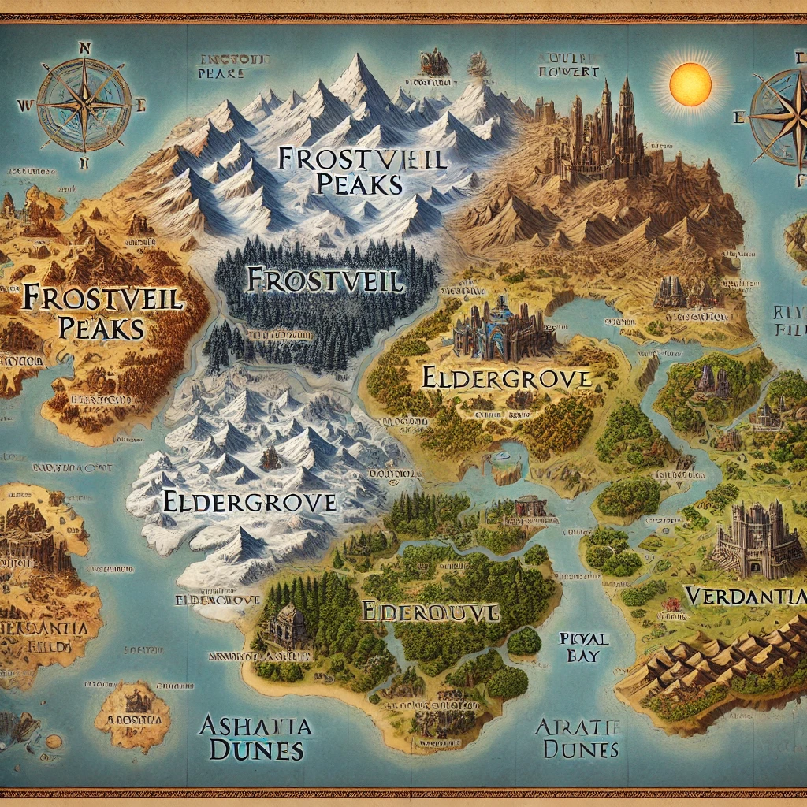

# Fantasy World Story and Quests

## Overview
This medieval fantasy world is divided into four key regions, each with its own unique culture, landscape, and challenges. The player begins their journey in the central kingdom, tasked with a monumental quest that spans across these regions. Each region holds ancient relics that must be recovered to stop an impending catastrophe. Along the way, the player will meet diverse characters, solve intricate puzzles, and face moral decisions that shape the fate of the world.

## Regions

### 1. Frostveil Peaks (Northern Region)
A harsh, icy mountain range, home to secluded tribes and ancient secrets buried beneath the ice.

#### Key Locations
- **Iceborn Citadel**: A frozen fortress that once belonged to an immortal king.
- **Glacier Caverns**: Maze-like ice tunnels where explorers often disappear.
- **Wolvesbane Village**: A remote village known for its skilled hunters and survivalists.

#### Quests
- **Quest: Crown of Winter**: The player must retrieve the Crown of Winter from the Iceborn Citadel by passing the trials set by the Frozen King.
- **Quest: The Lost Expedition**: After finding an explorer's journal, the player must uncover what happened to a missing party in the Glacier Caverns.

#### Characters
- **Thornwyn**: A reclusive ranger familiar with hidden paths in the mountains, available as a guide.
- **Frozen King**: An ancient ruler locked in eternal ice, who sets trials for those seeking the Crown of Winter.

---

### 2. Eldergrove (Eastern Region)
An enchanted, mystical forest where nature is alive with magic, and the trees seem to shift and change.

#### Key Locations
- **Sylvan Spire**: A tower where druids gather to protect the forest’s magical balance.
- **Whispering Glade**: A mysterious meadow where strange voices can be heard at night.
- **Fae Maze**: An ever-changing maze filled with magical creatures that guard sacred relics.

#### Quests
- **Quest: Spirit of the Wilds**: Gain the trust of the Forest Spirit by restoring balance to the enchanted forest.
- **Quest: Druid’s Trial**: Prove your worth to the druids by navigating the Fae Maze and outwitting magical beings.

#### Characters
- **Liriel**: A young druid exiled from her circle for attempting to communicate with the Forest Spirit.
- **Forest Spirit**: The guardian of the Eldergrove, who only helps those pure of heart.

---

### 3. Ashen Dunes (Southern Region)
A barren desert filled with ancient ruins, forgotten temples, and dangerous nomadic tribes.

#### Key Locations
- **Temple of the Sun**: A buried temple said to house a legendary artifact, the Sunblade.
- **Sandstorm Basin**: An area prone to violent sandstorms, where many treasures are buried.
- **Nomad's Rest**: A nomadic outpost where desert tribes trade and exchange stories.

#### Quests
- **Quest: The Sunblade**: Find the Sunblade hidden in the Temple of the Sun by solving ancient puzzles.
- **Quest: Nomad's Dilemma**: Broker peace between warring desert tribes or side with one faction to dominate the Ashen Dunes.

#### Characters
- **Amira**: Leader of a nomadic tribe who can either become a trusted ally or a formidable enemy.
- **Desert Guardians**: Creatures protecting the ancient relics buried beneath the sands.

---

### 4. Verdantia Fields (Western Region)
A fertile land of rivers, villages, and rolling hills, rich in history and culture.

#### Key Locations
- **Brightspire**: The central royal city, a hub of commerce and political intrigue.
- **The Weeping Tree**: A massive, ancient tree said to hold the souls of past rulers.
- **Riverwatch Village**: A small fishing village known for its tales of sea monsters.

#### Quests
- **Quest: The Court of Shadows**: Unravel the political plots in Brightspire, choosing whether to support the royal family or join a rebellion.
- **Quest: Legends of the Sea**: Investigate rumors of sea monsters in Riverwatch Village, leading to a greater discovery in the Abyssal Sea.

#### Characters
- **Lord Eryndor**: A cunning noble who seeks to overthrow the king of Brightspire and install himself as ruler.
- **Elara**: A revolutionary leader determined to bring about a new era in Verdantia Fields.

---

## Main Storyline

The player, an adventurer seeking fortune, is thrust into a world-threatening conflict when they uncover the ancient prophecy of the Four Relics. To prevent the rise of a malevolent force from beyond the Abyssal Sea, the player must travel across the regions to recover the four relics hidden within each land: the **Crown of Winter**, the **Heart of the Wilds**, the **Sunblade**, and the **Tear of Verdantia**.

### Overarching Questline
- **The Prophecy of the Four Relics**: Uncover the ancient prophecy, which foretells the rise of a dark power unless the four sacred relics are united.
- **Alliance or Betrayal**: Throughout the journey, the player can forge alliances with key characters like Liriel, Amira, and Lord Eryndor, or betray them for personal gain.
- **Final Confrontation**: After collecting the relics, the player must face the dark force threatening the world, with different endings based on the choices made throughout the game.

---

## Mechanics and Gameplay

### Exploration
- Travel between regions, each with unique environmental hazards (e.g., sandstorms in Ashen Dunes, icy winds in Frostveil Peaks).
- Solve puzzles to access hidden relics and areas.

### Combat
- Engage in strategic combat against enemies, using allies and relics to gain advantages.

### Moral Choices
- Decisions throughout the game influence character relationships and the overall outcome of the story.

---

## Artifacts
- **Crown of Winter**: Grants control over ice and cold, found in Frostveil Peaks.
- **Heart of the Wilds**: A mystical gem that channels nature's magic, hidden in Eldergrove.
- **Sunblade**: A sword that harnesses the power of the sun, buried in Ashen Dunes.
- **Tear of Verdantia**: A relic said to hold the essence of Verdantia’s fertility and prosperity.

---

## Characters and Relationships

As the player interacts with various characters across the regions, they can forge strong bonds, gain allies, or make enemies. Characters like Thornwyn, Liriel, Amira, and Lord Eryndor will offer unique quests, dialogue options, and possible betrayals based on the player’s decisions.

- **Thornwyn**: A loyal guide who helps you navigate Frostveil Peaks.
- **Liriel**: A druid whose quest for redemption offers powerful rewards in Eldergrove.
- **Amira**: A nomadic leader with the key to unlocking ancient desert secrets.
- **Lord Eryndor**: A noble schemer with ambitions to rule Verdantia Fields.

